  

  # 🚀 Luweng Ecosystem — Official Release Center
  **High-Performance Android Kernels • Systemless Hardware Optimization Engines • Security Utilities**

  
  
  

---

### ⭐ Support Continuous Engineering
If you appreciate our projects and the thousands of hours of development and silicon testing, **please give this repository a Star (⭐) at the top right!** Your support keeps the development and regular updates active.

---

### ⚡ Quick Navigation

| Project | Target | Latest Version | Quick Link |
| :--- | :--- | :--- | :--- |
| **LuwengKernel Reborn** | Realme MT6785 (ARM64) | `Reborn (4.14.357)` | [Jump to Kernel](#-luwengkernel-reborn) |
| **LuwengSense Reborn** | Universal Android 8.0 - 16 | `Reborn (v200)` | [Jump to LuwengSense](#-luwengsense-reborn) |
| **L-Blocker** | Universal Android System | `v1.0.0` | [Jump to L-Blocker](#-l-blocker) |
| **Historical Archive** | Legacy & Previous Editions | `Archive` | [Jump to Archive](#-legacy--historical-archive) |

---

### ⚡ LuwengKernel Reborn

The signature custom high-performance Linux kernel engineered for Realme Helio G90T / MT6785 platforms, featuring zero-lag thread scheduling and deep root-cloaking capabilities.

* **Toolchain & Linking:** Azure Clang with ThinLTO optimization
* **Upstream Base:** Linux 4.14.357 (ARM64)
* **Root & Cloaking:** Native SuSFS v1.5.5 + ReSukiSU Driver integration
* **Hardware Sched:** Microsecond thread scheduling with custom governor parameters
* **Networking & Memory:** Low-latency packet scheduling (BBR + FQ-CoDel), ZSTD/LZ4 compression

#### Supported Devices
* Realme 6 (RMX2001)
* Realme 6s (RMX2002)
* Realme 6i EU (RMX2003)
* Realme 7 (RMX2151)
* Realme Narzo 20 Pro
* Realme Narzo 30 4G

#### 📥 Download LuwengKernel Reborn
* **[LuwengKernel-Reborn-ReSukiSU-SuSFS.zip](https://github.com/KepalaLuweng/Luweng-Releases/releases/download/LuwengKernel-Reborn/LuwengKernel-Reborn-ReSukiSU-SuSFS.zip)** (Recommended: Full SuSFS & Root Cloak)
* **[LuwengKernel-Reborn-Normal.zip](https://github.com/KepalaLuweng/Luweng-Releases/releases/download/LuwengKernel-Reborn/LuwengKernel-Reborn-Normal.zip)** (Stock Rootless / Clean Flavor)

#### Installation
1. Reboot to custom recovery (TWRP / OrangeFox / PBRP).
2. Backup your current `boot` and `dtbo` partitions.
3. Flash the selected `.zip` file.
4. Reboot system.

---

### 🔥 LuwengSense Reborn

100% native systemless hardware performance and thermal management engine with an interactive WebUI dashboard. Compatible with **KernelSU, ReSukiSU, APatch, and Magisk**.

* **Hardware Synergy:** Native handshake with LuwengKernel for automatic governor frequency and network buffer tuning.
* **Cyberpunk WebUI:** Interactive real-time hardware telemetry (CPU clusters, RAM, active governor, profiles).
* **Dynamic Profiles:** Switch between `Eco`, `Normal`, `Gaming`, and `Extreme` in a single tap.
* **Universal Compatibility:** Intelligent tiered fallback supporting modern Android SoCs (Snapdragon, MediaTek, Exynos, Tensor).

#### 📥 Download LuwengSense Reborn
* **[LuwengSense.Reborn.zip](https://github.com/KepalaLuweng/Luweng-Releases/releases/download/LuwengSense-Reborn/LuwengSense.Reborn.zip)** (Universal Flashable Module)

#### Installation
1. Open your Root Manager (KernelSU, ReSukiSU, APatch, or Magisk).
2. Go to the **Modules** tab.
3. Tap **Install from storage** and choose `LuwengSense.Reborn.zip`.
4. Reboot your device to initialize background services.
5. Access the WebUI dashboard from the module Action button or browser.

---

### 🛡️ L-Blocker

Lightweight system-level domain filter and DNS security shield for privacy enhancement and ad-domain reduction.

#### 📥 Download L-Blocker
* **[L-Blocker.v1.0.0.zip](https://github.com/KepalaLuweng/Luweng-Releases/releases/download/L-Blocker-v1.0.0/L-Blocker.v1.0.0.zip)**

---

### 📦 Legacy & Historical Archive

All previous editions are preserved below for historical reference and legacy hardware support:

| Project | Release Tag | Description | Asset Download |
| :--- | :--- | :--- | :--- |
| **LuwengKernel** | `Legacy (EOL)` | Android 11-16 SuSFS KernelSU Suite | [Download](https://github.com/KepalaLuweng/Luweng-Releases/releases/tag/LuwengKernel-Legacy) |
| **LuwengKernel** | `GamingEdition` | Gaming Edition EOL (A11-A16) | [Download](https://github.com/KepalaLuweng/Luweng-Releases/releases/tag/LuwengKernel-Gaming) |
| **LuwengKernel** | `MerdekaEdition` | Merdeka Independence Edition | [Download](https://github.com/KepalaLuweng/Luweng-Releases/releases/tag/LuwengKernel-Merdeka) |
| **LuwengKernel** | `v4` | Kernel 4.14 v4 KSU & Normal | [Download](https://github.com/KepalaLuweng/Luweng-Releases/releases/tag/LuwengKernel-v4) |
| **LuwengKernel** | `v3` | Kernel 4.14 v3 KSU & Normal | [Download](https://github.com/KepalaLuweng/Luweng-Releases/releases/tag/LuwengKernel-v3) |
| **LuwengKernel** | `v2` | Kernel Daily 358 LTO | [Download](https://github.com/KepalaLuweng/Luweng-Releases/releases/tag/LuwengKernel-v2) |
| **LuwengKernel** | `v1` | Kernel Daily 348 Stable | [Download](https://github.com/KepalaLuweng/Luweng-Releases/releases/tag/LuwengKernel-v1) |
| **LuwengKernel** | `Initial` | Kernel Initial 336 Build | [Download](https://github.com/KepalaLuweng/Luweng-Releases/releases/tag/LuwengKernel-Initial) |
| **LuwengSense** | `Legacy (EOL)` | LuwengSense Legacy Module | [Download](https://github.com/KepalaLuweng/Luweng-Releases/releases/tag/LuwengSense-Legacy) |
| **LuwengSense** | `ZenithUpdate` | Zenith Edition Update | [Download](https://github.com/KepalaLuweng/Luweng-Releases/releases/tag/LuwengSense-ZenithUpdate) |
| **LuwengSense** | `Zenith` | Zenith Edition Stable | [Download](https://github.com/KepalaLuweng/Luweng-Releases/releases/tag/LuwengSense-Zenith) |
| **LuwengSense** | `Legendary21082025` | Legendary Edition Update | [Download](https://github.com/KepalaLuweng/Luweng-Releases/releases/tag/LuwengSense-Legendary21082025) |
| **LuwengSense** | `Legendary` | Legendary Edition Archive | [Download](https://github.com/KepalaLuweng/Luweng-Releases/releases/tag/LuwengSense-Legendary) |
| **LuwengSense** | `v1.4.1` | Stable v1.4.1 Module | [Download](https://github.com/KepalaLuweng/Luweng-Releases/releases/tag/LuwengSense-v1.4.1) |
| **LuwengSense** | `v1.4.0` | Stable v1.4.0 Module | [Download](https://github.com/KepalaLuweng/Luweng-Releases/releases/tag/LuwengSense-v1.4.0) |
| **LuwengSense** | `v1.3.0` | Stable v1.3.0 Module | [Download](https://github.com/KepalaLuweng/Luweng-Releases/releases/tag/LuwengSense-v1.3.0) |
| **LuwengSense** | `v1.2.0` | Stable v1.2.0 Module | [Download](https://github.com/KepalaLuweng/Luweng-Releases/releases/tag/LuwengSense-v1.2.0) |
| **LuwengSense** | `v1.1.0` | Stable v1.1.0 Module | [Download](https://github.com/KepalaLuweng/Luweng-Releases/releases/tag/LuwengSense-v1.1.0) |

---

### 🌐 Official Community & Links

* **Telegram Official Channel:** [t.me/luwengtechofficial](https://t.me/luwengtechofficial)
* **YouTube Tech Channel:** [youtube.com/@LuwengTechID](https://youtube.com/@LuwengTechID)
* **GitHub Profile:** [github.com/KepalaLuweng](https://github.com/KepalaLuweng)
